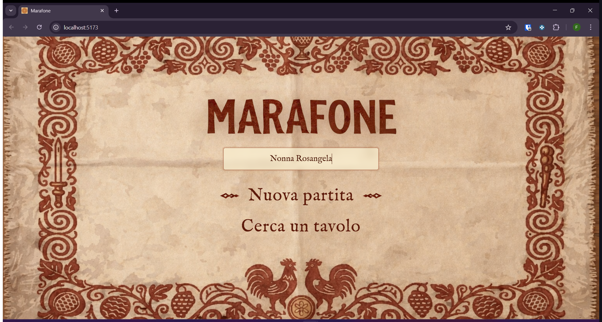

# Identità visiva — Marafone

Linee guida estetiche e decisioni di design per rendere l'app riconoscibile e coerente con le radici del gioco.

---

## Concept

L'obiettivo è evocare una **partita di carte in un'osteria romagnola**: un tavolo di legno scuro, la tovaglia di iuta, carte consunte, il calore delle lampade a olio. Non un'app di gioco generica, ma un oggetto con una sua memoria e identità regionale.

Il gioco deve essere **desiderabile**: qualcuno dovrebbe preferire giocare qui piuttosto che con un mazzo fisico. L'estetica non è decorazione — è il motivo per cui si torna.

**Principio guida: mostrare > spiegare.** Niente popup di testo dove può parlare un'animazione. La carta sbatte sul tavolo invece del messaggio "Nonna Anna ha bussato".

---

## Moodboard

- Tovaglie e stampe in linotipo da mercati contadini italiani
- Insegne dipinte a mano di osterie emiliane e romagnole
- Mazzi di carte napoletane pixel art
- Balatro (firma visiva pixel art, non poker)

---

## Architettura visiva — tre schermate, tre ambienti

| Schermata | Ambiente | Metafora fisica |
|---|---|---|
| Home + Lobby | Tovaglia vista dall'alto | Stai ancora guardando il tavolo da fuori |
| Transizione | Video AI 2s | Ti siedi: la visuale scende e si inclina |
| Game | Tavolo di legno in prospettiva | Sei seduto, le carte in mano, il tavolo davanti |

Il passaggio non è un cambio di schermata — è un cambio di posizione nello spazio.

---

## Assets chiave

| Asset | Uso | Stato |
|---|---|---|
| `background.png` | Sfondo home e lobby — tovaglia flat top-down | ✅ In uso |
| `title.png` | Logo MARAFONE in legno dipinto | ✅ In uso |
| `arrow.png` | Selettore menu (frecce a rombo) | ✅ In uso |
| `cards.png` | Sprite sheet mazzo napoletano 10×4, pixel art | ✅ In uso |
| `table-perspective.png` | Tavolo osteria visto da seduto — sfondo GameScreen | 🔲 Da generare (frame 2 già pronto) |
| `card-back.png` | Dorso carte — mandala su pergamena ruggine | 🔲 Da integrare (asset già generato) |
| `intro.webm` | Video transizione lobby→game (2s, AI-interpolato) | 🔲 Da generare (2 frame già pronti) |

### Frame per il video di transizione
- **Frame 1** (inizio): tovaglia top-down, stessa inquadratura della lobby
- **Frame 2** (fine): tavolo di legno in prospettiva ~30° da seduto, tovaglietta centrale visibile
- Tool consigliati: Veo 3 (Google AI Studio) o Kling AI

---

## Palette colori

| Ruolo | Token CSS | Valore | Note |
|---|---|---|---|
| Rosso ruggine | `--color-rust` | `#5c1a0a` | Testo principale su sfondo chiaro |
| Rosso hover | `--color-rust-hover` | `#7a2210` | Stato hover/attivo |
| Crema iuta | `--color-cream` | `#f5e6c4` | Colore base tovaglia e testo su scuro |
| Parchment input | `--color-parchment` | `rgba(255, 248, 218, 0.62)` | Sfondi input e card |
| Bordo ruggine | `--color-border` | `rgba(120, 48, 18, 0.42)` | Bordi elementi in home/lobby |
| Legno scuro | `--color-wood` | `#2a1a0e` | Tavolo osteria (GameScreen background) |
| Oro ambra | `--color-gold` | `#c8922a` | Accenti attivi — turno corrente, briscola |
| Oro scuro | `--color-gold-dark` | `#9a6e1a` | Bordi e ombre sugli elementi oro |
| Inchiostro | `--color-ink` | `#1a0f0a` | Testo su sfondi chiari ad alto contrasto |
| Team A — Ambra | `--color-team-a` | `#c8922a` | Squadra A |
| Team B — Terracotta | `--color-team-b` | `#8b3a1a` | Squadra B (rimpiazza il blu — più coerente con l'osteria) |

**Eliminato:** verde feltro (tutte le varianti `felt-*` presenti in `index.css`) — evoca il poker, non l'osteria.
**Eliminato:** blu squadra `#1d4ed8` — fuori palette, sostituito con terracotta `#8b3a1a`.

---

## Tipografia

| Font | Token CSS | Uso |
|---|---|---|
| **Cinzel** | `--font-display` | Titoli, codice stanza, bottoni d'azione — romano inciso, autorità |
| **IM Fell English** | `--font-body` | Testo interfaccia home/lobby — tipografia a caratteri mobili, rustico |
| **Outfit** | `--font-ui` | UI di gioco (nomi, HUD, ping) — neutro e leggibile a piccole dimensioni |

La gerarchia è intenzionale: Cinzel comanda, IM Fell English racconta, Outfit si fa da parte.

---

## Animazioni

### Home / Lobby
- **`animate-float`** sul titolo — respiro lento 3.2s, evoca qualcosa appeso o incorniciato
- **Cross-fade 380ms** tra schermate — il `background.png` resta fisso, solo il contenuto dissolve
- **`input-shake`** sull'input nome se si tenta di procedere a vuoto
- **`corner-toast-pop`** per la briscola scelta — rimbalzo elastico

### Transizione lobby → game
- Video `intro.webm` sovrapposto in fullscreen, fade-in su lobby, 2s, fade-out su GameScreen
- Sotto il video, il layout di gioco è già pronto — il video è il sipario
- Fallback se video non disponibile: cross-fade diretto 600ms

### GameScreen
- **Carta giocata**: vola dal basso verso il centro con leggera rotazione, poi "atterra" (micro-rimbalzo + ombra che si espande e ritrae)
- **Bussata**: stessa animazione, impatto più forte, leggera vibrazione residua del tavolo
- **Carta vincente**: trillo (wobble 650ms) + glow oro (2s)
- **Raccolta mano**: le carte si contraggono verso l'angolo della squadra vincente
- **Indicatore turno**: alone luminoso dorato sull'area del giocatore attivo — nessun testo, nessun badge

---

## GameScreen — architettura tecnica

```
┌─────────────────────────────────────┐
│  BACKGROUND: table-perspective.png  │  ← immagine statica, tavolo ~30°
│  ┌───────────────────────────────┐  │
│  │  .piano-gioco                 │  │  ← div con CSS perspective transform
│  │  transform: perspective(900px)│  │    combaciante con l'angolo del PNG
│  │           rotateX(28deg)      │  │
│  │   [carte giocate cadono qui]  │  │
│  └───────────────────────────────┘  │
│                                     │
│  [nomi e HUD flat, sopra tutto]     │  ← z-index alto, no transform
│                                     │
│  [mano giocatore: flat, in basso]   │  ← flat è corretto: tieni le carte su
└─────────────────────────────────────┘
```

Il valore esatto di `rotateX` si calibra visivamente sull'immagine di sfondo (punto di partenza: 28deg).

**Ombra direzionale**: le carte sul `.piano-gioco` hanno `drop-shadow` verso il basso-destra, coerente con luce dall'alto-sinistra (come nel frame 2).

**Posizioni giocatori** (riferimento a seduto in basso):
- Bottom (io): mano flat in basso, nome + HUD
- Top (avversario di fronte): badge nome in alto, carte impilate visibili
- Left / Right (laterali): badge nome laterale, carte impilate con rotazione 90°

---

## Componenti UI — specifiche dettagliate

### HomeScreen



- Background: `background.png` fullscreen, nessuna ripetizione
- Titolo: `title.png` con `animate-float` (3.2s)
- Input nome: font IM Fell English, bordo ruggine, background parchment; `input-shake` se vuoto
- Menu voci: Cinzel, testo grande, frecce `arrow.png` laterali; opacity transition sulle frecce
- Nessun bottone classico: voci di menu come righe di testo stile arcade/console anni '80

### LobbyScreen
- Background: stesso `background.png` (nessun flash tra home e lobby)
- 4 posti al tavolo disposti come sarebbero fisicamente (non griglia 2×2 astratta):
  - Top: posto 2 (avversario di fronte)
  - Left: posto 3, Right: posto 1
  - Bottom: posto 0 (io)
- Posto occupato: avatar con nome in Cinzel, badge team (ambra o terracotta)
- Posto libero: silhouette tratteggiata, testo "In attesa..." in IM Fell English italic
- Codice stanza: Cinzel grande, bordo ruggine, click-to-copy con feedback visivo
- Bottone "Pronto": Cinzel, sfondo ruggine, hover hover-rust; appare solo se tutti i posti occupati o sei host

### GameScreen (quando `table-perspective.png` disponibile)
- Background: `table-perspective.png` fullscreen cover
- Overlay scuro trasparente per leggibilità HUD: `rgba(0,0,0,0.15)`
- `.piano-gioco`: 40vw × 30vw max, centrato verticalmente a ~55% altezza schermo
- ScoreBoard: top-left, font Outfit, sfondo `rgba(42,26,14,0.75)`, bordo oro sottile
- BriscolaIndicator: bottom-right corner, `corner-toast-pop` all'apparizione
- Mano giocatore: bottom-center, carte flat con leggero fan (overlap + rotazione per indice)
- PlayerArea avversari: top e laterali, badge flat, no transform

### GameOverScreen
- Background: stesso `background.png` (ritorno alla tovaglia)
- Testo vincitore: Cinzel grande, colore team
- Punteggi: IM Fell English
- Bottone "Nuova partita": stesso stile menu home

---

## Scelte UX specifiche

- **Nessun bottone classico in home/lobby**: voci di menu come righe di testo con frecce laterali — stile menu arcade/console anni '80
- **Frecce `arrow.png` come selettore**: rispecchiate via `scaleX(-1)` per la sinistra; appaiono/spariscono con opacity transition
- **Input nome tra titolo e menu**: prima mi identifico, poi scelgo
- **Sfondo persistente home↔lobby**: la tovaglia non scompare tra le due schermate
- **Feedback visivo senza testo**: bussata = vibrazione tavolo + impatto sonoro visivo; raccolta = carte che volano; turno = glow, non badge
- **Codice stanza sempre visibile in lobby**: grande, copiabile con un click

---

## Cosa non fare

- Niente verde feltro (evoca poker/casinò) — rimuovere tutte le varianti `felt-*`
- Niente blu squadra `#1d4ed8` — fuori palette
- Niente popup di testo dove può parlare un'animazione
- Niente ombre blur su elementi interattivi nella GameScreen (stile pixel art: ombre solide o drop-shadow semplice)
- Niente font sans-serif in home/lobby (rompono l'immersione)
- Niente animazioni "ingenue": bounce senza peso, fade senza timing, transizioni lineari
- Niente griglia 2×2 astratta in lobby — i posti devono sembrare sedie attorno a un tavolo
